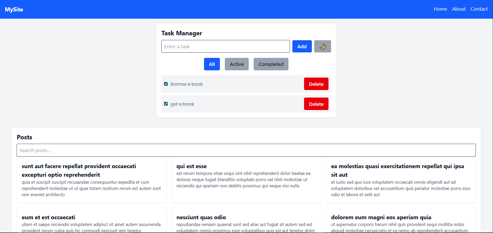
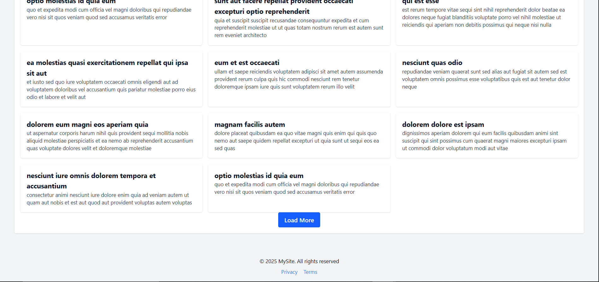
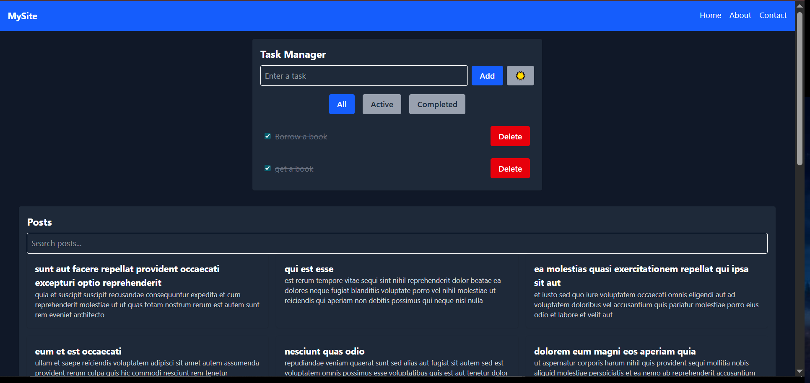
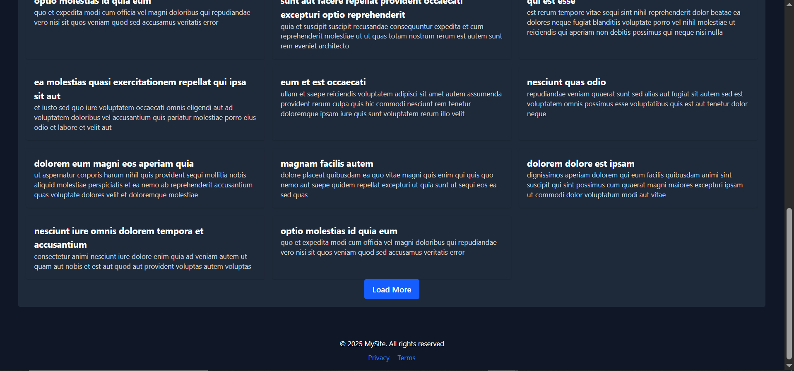

# Task Manager App

A simple, modern Task Manager built with React and TailwindCSS v4.1, featuring dark mode support, persistent tasks using local storage, and a clean, responsive UI.

## Features

- Add, complete, and delete tasks
- Filter tasks (All, Active, Completed)
- Dark mode toggle (with Tailwind v4.1 support)
- Persistent tasks using local storage
- Responsive design
- Clean, accessible UI

## Project Structure

```
week-3-assignment/
├── public/
│   ├── screenshot-dark1.png
│   ├── screenshot-dark2.png
│   ├── screenshot-light1.png
│   └── screenshot-light2.png
├── src/
│   ├── components/
│   │   ├── layout/
│   │   │   ├── Footer.jsx
│   │   │   ├── Layout.jsx
│   │   │   └── Navbar.jsx
│   │   ├── ui/
│   │   │   ├── Button.jsx
│   │   │   └── Card.jsx
│   │   ├── PostList.jsx
│   │   └── TaskManager.jsx
│   ├── context/
│   │   └── ThemeContext.jsx
│   ├── hooks/
│   │   └── useLocalStorage.js
│   ├── pages/
│   │   ├── About.jsx
│   │   ├── Contact.jsx
│   │   └── Home.jsx
│   ├── App.jsx
│   ├── index.css
│   └── main.jsx
├── index.html
├── package.json
├── tailwind.config.js
├── vite.config.js
└── README.md
```

## Setup Instructions

1. **Clone the repository:**
   ```bash
   git clone <your-repo-url>
   cd week-3-assignment
   ```

2. **Install dependencies:**
   ```bash
   npm install
   # or
   pnpm install
   ```

3. **Run the development server:**
   ```bash
   npm run dev
   # or
   pnpm dev
   ```

4. **Build for production:**
   ```bash
   npm run build
   # or
   pnpm build
   ```

5. **Preview the production build:**
   ```bash
   npm run preview
   # or
   pnpm preview
   ```

## Screenshots

Here are screenshots of the application in both light and dark mode:

### Light Mode



### Dark Mode



## Deployment

This application can be easily deployed to Vercel, Netlify, or GitHub Pages.

### Deploy to Vercel

1. Push your code to GitHub.
2. Go to [Vercel](https://vercel.com/), import your repository, and follow the prompts.
3. Set the build command to `npm run build` and the output directory to `dist`.

### Deploy to Netlify

1. Push your code to GitHub.
2. Go to [Netlify](https://netlify.com/), import your repository, and follow the prompts.
3. Set the build command to `npm run build` and the publish directory to `dist`.

### Deploy to GitHub Pages

1. Install the `gh-pages` package:
   ```bash
   npm install --save-dev gh-pages
   ```
2. Add the following scripts to your `package.json`:
   ```json
   "scripts": {
     "predeploy": "npm run build",
     "deploy": "gh-pages -d dist"
   }
   ```
3. Deploy:
   ```bash
   npm run deploy
   ```

## Live Demo

> Replace the URL below with your deployed application's URL after deployment.

**Live URL:** [https://your-deployment-url.com](https://your-deployment-url.com)

---

## Technologies Used

- [React](https://react.dev/)
- [TailwindCSS v4.1](https://tailwindcss.com/docs/installation)
- [Vite](https://vitejs.dev/)
- [LocalStorage API](https://developer.mozilla.org/en-US/docs/Web/API/Window/localStorage)

## Credits

- Built by GeoKoder
- Inspired by modern productivity apps

---

**Note:**  
- Make sure to add screenshots in a `screenshots/` folder at the root or in `public/` and update the image paths in the README.  
- Update the deployed URL after you deploy your app.
